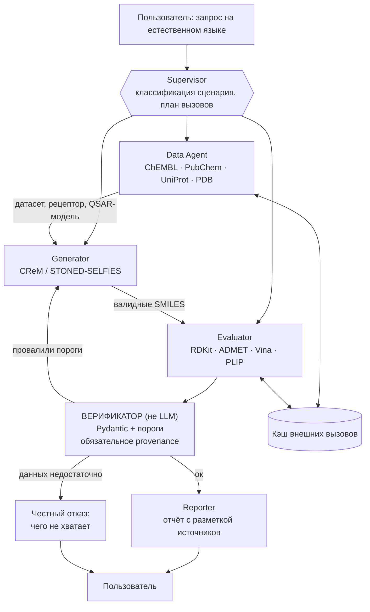

# Архитектура

Полное описание ролей и обоснование — `PLAN-case1-sintez.md` §3.

```mermaid
graph TD
    U[Пользователь: запрос на естественном языке] --> S
    S{{"Supervisor<br/>классификация сценария, план вызовов"}}
    S --> D["Data Agent<br/>ChEMBL · PubChem · UniProt · PDB"]
    S --> G["Generator<br/>CReM / STONED-SELFIES"]
    S --> E["Evaluator<br/>RDKit · ADMET · Vina · PLIP"]
    D -->|датасет, рецептор, QSAR-модель| G
    G -->|валидные SMILES| E
    E --> V
    V["ВЕРИФИКАТОР (не LLM)<br/>Pydantic + пороги<br/>обязательное provenance"]
    V -->|провалили пороги| G
    V -->|данных недостаточно| R
    V -->|ок| REP
    REP["Reporter<br/>отчёт с разметкой источников"]
    R["Честный отказ:<br/>чего не хватает"]
    REP --> OUT[Пользователь]
    R --> OUT
    CACHE[(Кэш внешних вызовов)]
    D <--> CACHE
    E <--> CACHE
```

Максимум 2 круга возврата — иначе демо не укладывается в минуту.
